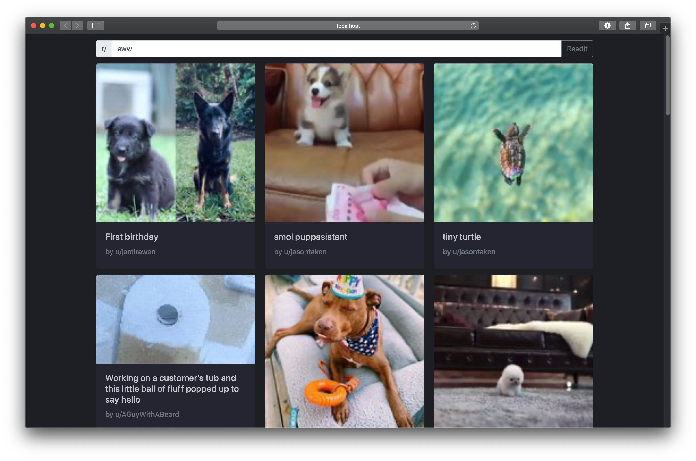
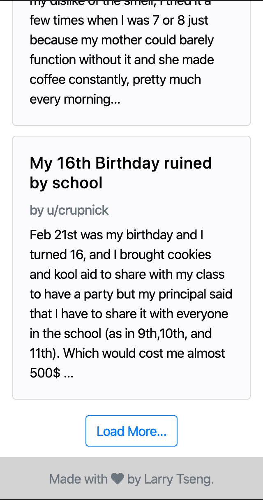

# Readit: A Modern Reddit Feed
Website: [https://ltseng01.github.io/Readit](https://ltseng01.github.io/Readit)

Introducing Readit, a brand new Reddit feed created with design in mind. Featuring an intuitive and elegant layout, it makes following up on your favorite Reddit posts easier with less distractions and clutter. Works on almost all screen sizes and browsers for maximum compatibility.

### Features:
- Dark Mode 🌒/☀️ – switch between interfaces depending on your operating system's settings
- Responsive Layout 📱 – works for all screen sizes from phone to desktop
- Clean Text – easy to read font and large characters
- Load More – satisfy your Reddit binge by loading more posts
- Thumbnails 🌉 – posts with images will have thumbnails 
– Animations – smooth animations bring in new posts

### Frameworks & Libraries:
- [Animate.css](https://daneden.github.io/animate.css/)
- [Bootstrap](https://getbootstrap.com)
- [JQuery](https://jquery.com)
- [Mustache](http://mustache.github.io)
- [Font Awesome](https://fontawesome.com)
- [Reddit API](https://www.reddit.com/dev/api/)

### Enter the wrong subreddit name? Get visual feedback.

### Mobile

### Tablet

## Questions or Bugs?
Feel free to create an issue or contact me! Thanks!

- Larry
