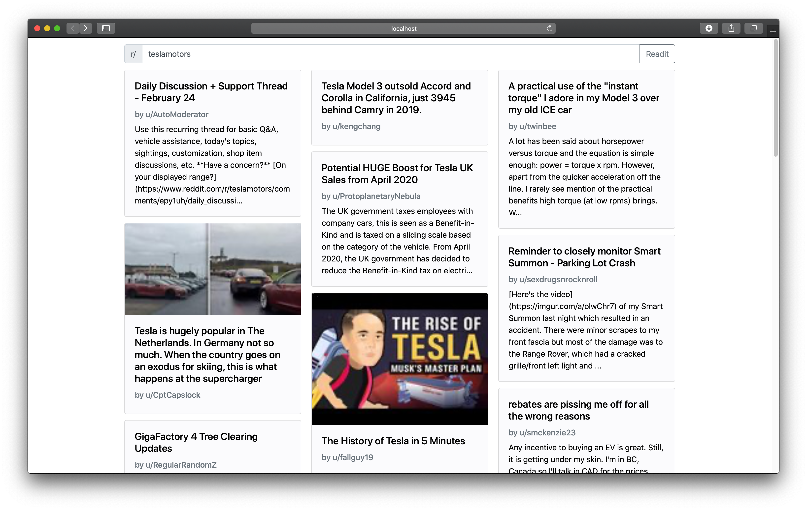
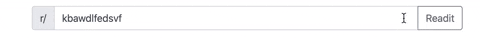

# Readit: A Modern Reddit Feed

Introducing Readit, a brand new Reddit feed created with design in mind.

### Features:
- Dark Mode 🌒/☀️ – switch between interfaces depending on your operating system's settings
- Responsive Layout – works for all screen sizes from phone to desktop
- Clean Text – easy to read font and large characters
- Load More – satisfy your Reddit binge by loading more posts
- Thumbnails – posts with images will have thumbnails 
– Animations – smooth animations bring in new posts

### Frameworks & Libraries:
- [Animate.css](https://daneden.github.io/animate.css/)
- [Bootstrap](https://getbootstrap.com)
- [JQuery](https://jquery.com)
- [Mustache](http://mustache.github.io)
- [Font Awesome](https://fontawesome.com)

### Enter the wrong subreddit name? No problem.

### Mobile

